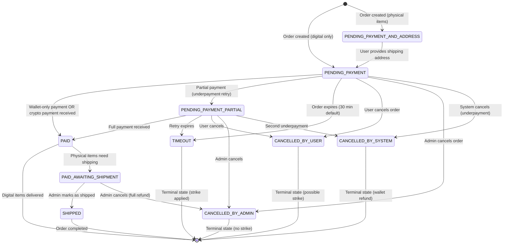

# Order Status State Machine

## Overview

This document describes the complete state machine for order status transitions in the AiogramShopBot. Each order progresses through various states based on user actions, payment events, and admin operations.

## Order Status Enum

```python
class OrderStatus(Enum):
    PENDING_PAYMENT = "PENDING_PAYMENT"
    PENDING_PAYMENT_AND_ADDRESS = "PENDING_PAYMENT_AND_ADDRESS"
    PENDING_PAYMENT_PARTIAL = "PENDING_PAYMENT_PARTIAL"
    PAID = "PAID"
    PAID_AWAITING_SHIPMENT = "PAID_AWAITING_SHIPMENT"
    SHIPPED = "SHIPPED"
    TIMEOUT = "TIMEOUT"
    CANCELLED_BY_USER = "CANCELLED_BY_USER"
    CANCELLED_BY_ADMIN = "CANCELLED_BY_ADMIN"
    CANCELLED_BY_SYSTEM = "CANCELLED_BY_SYSTEM"
```

## State Diagram (Mermaid)



## Detailed State Transitions

### 1. Order Creation

**Initial States:**
- `PENDING_PAYMENT`: Order contains only digital items
- `PENDING_PAYMENT_AND_ADDRESS`: Order contains physical items (requires shipping address)

**Trigger:** User completes cart checkout

**Actions:**
- Reserve items (mark as unavailable for other users)
- Set `order.expires_at = now() + ORDER_TIMEOUT_MINUTES`
- Create order record with initial status

**Code:** `services/order.py:create_order()`

---

### 2. Address Submission (Physical Items Only)

**Transition:** `PENDING_PAYMENT_AND_ADDRESS` → `PENDING_PAYMENT`

**Trigger:** User provides shipping address via FSM

**Preconditions:**
- Order status is `PENDING_PAYMENT_AND_ADDRESS`
- Valid shipping address provided

**Actions:**
- Save shipping address to `order.shipping_address` (JSON)
- Update status to `PENDING_PAYMENT`
- Proceed to payment selection

**Code:** `handlers/user/order.py` (FSM handler for address input)

---

### 3. Successful Payment

**Transitions:**
- `PENDING_PAYMENT` → `PAID` (digital items)
- `PENDING_PAYMENT` → `PAID_AWAITING_SHIPMENT` (physical items)
- `PENDING_PAYMENT_PARTIAL` → `PAID` or `PAID_AWAITING_SHIPMENT`

**Trigger:**
- Wallet balance covers full amount (immediate)
- Crypto payment received via KryptoExpress webhook

**Actions:**
1. Deduct wallet balance (if used)
2. Mark items as sold (`item.is_sold = True`)
3. Create Buy records (item delivery tracking)
4. Update order status
5. For digital items: Deliver private_data immediately
6. For physical items: Set `PAID_AWAITING_SHIPMENT`
7. Notify user

**Code:**
- `services/payment.py:orchestrate_payment_processing()`
- `processing/payment_handlers.py:handle_paid_status()`

---

### 4. Partial Payment (Underpayment Retry)

**Transition:** `PENDING_PAYMENT` → `PENDING_PAYMENT_PARTIAL`

**Trigger:** KryptoExpress webhook with UNDERPAYMENT status (first occurrence)

**Preconditions:**
- Payment received < expected amount (outside tolerance)
- `payment_attempt = 1` (first attempt)

**Actions:**
1. Create PaymentTransaction record
2. Create new invoice for remaining amount
3. Update order status to `PENDING_PAYMENT_PARTIAL`
4. Extend order expiration (additional 30 minutes)
5. Notify user with retry instructions

**Code:** `processing/payment_handlers.py:handle_underpayment()`

**Note:** Only ONE retry allowed. Second underpayment triggers `CANCELLED_BY_SYSTEM`.

---

### 5. Order Timeout

**Transition:**
- `PENDING_PAYMENT` → `TIMEOUT`
- `PENDING_PAYMENT_PARTIAL` → `TIMEOUT`

**Trigger:** Background job runs after `order.expires_at`

**Preconditions:**
- Current time > `order.expires_at`
- No payment received
- Order not already cancelled

**Actions:**
1. Update status to `TIMEOUT`
2. Mark all invoices as inactive (`is_active = 0`)
3. Release reserved items (restore stock)
4. Refund wallet if used (may include penalty)
5. Add strike to user (if outside grace period)
6. Notify user

**Penalties:**
- Within grace period (5 min default): No penalty, no strike
- After grace period: 5% penalty applied to refund, strike added

**Code:** `jobs/order_timeout_job.py`

---

### 6. User Cancellation

**Transition:**
- `PENDING_PAYMENT` → `CANCELLED_BY_USER`
- `PENDING_PAYMENT_AND_ADDRESS` → `CANCELLED_BY_USER`
- `PENDING_PAYMENT_PARTIAL` → `CANCELLED_BY_USER`

**Trigger:** User clicks "Cancel Order" button

**Preconditions:**
- Order not yet paid
- Order not expired (if expired, redirect to cart)

**Actions:**
1. Update status to `CANCELLED_BY_USER`
2. Mark all invoices as inactive
3. Refund wallet if used (may include penalty)
4. Release reserved items
5. Add strike if outside grace period

**Penalties:** Same as timeout (grace period + penalty rules)

**Code:** `services/order.py:cancel_order()`

---

### 7. Admin Cancellation

**Transition:**
- `PENDING_PAYMENT*` → `CANCELLED_BY_ADMIN`
- `PAID_AWAITING_SHIPMENT` → `CANCELLED_BY_ADMIN`

**Trigger:** Admin clicks "Cancel Order" with optional custom reason

**Preconditions:**
- Admin has cancellation permission
- Order not shipped yet

**Actions:**
1. Update status to `CANCELLED_BY_ADMIN`
2. Mark all invoices as inactive
3. **Full wallet refund (no penalty)**
4. Release reserved items (if not shipped)
5. Notify user with custom reason
6. **No strike applied**

**Code:** `handlers/admin/shipping_management.py:cancel_order_admin_execute()`

---

### 8. System Cancellation

**Transition:**
- `PENDING_PAYMENT` → `CANCELLED_BY_SYSTEM`
- `PENDING_PAYMENT_PARTIAL` → `CANCELLED_BY_SYSTEM`

**Trigger:** Second underpayment OR other system-detected issue

**Preconditions:**
- Second underpayment attempt fails
- OR payment fraud detected
- OR critical validation error

**Actions:**
1. Update status to `CANCELLED_BY_SYSTEM`
2. Mark all invoices as inactive
3. Credit received amount to user wallet
4. Release reserved items
5. Notify user with reason
6. No strike (system issue, not user fault)

**Code:** `processing/payment_handlers.py:handle_underpayment()`

---

### 9. Shipping (Physical Items)

**Transition:** `PAID_AWAITING_SHIPMENT` → `SHIPPED`

**Trigger:** Admin marks order as shipped

**Preconditions:**
- Order status is `PAID_AWAITING_SHIPMENT`
- Items are physical and require shipping

**Actions:**
1. Update status to `SHIPPED`
2. Notify user (order shipped, no tracking info yet)
3. Order moves to completed state

**Code:** `handlers/admin/shipping_management.py:mark_as_shipped()`

---

## Terminal States

Orders in terminal states cannot transition to other states:

- **`PAID`**: Digital items delivered, order complete
- **`SHIPPED`**: Physical items shipped, order complete
- **`TIMEOUT`**: Order expired, items restored, possible strike
- **`CANCELLED_BY_USER`**: User cancelled, items restored, possible strike/penalty
- **`CANCELLED_BY_ADMIN`**: Admin cancelled, full refund, no strike
- **`CANCELLED_BY_SYSTEM`**: System cancelled, wallet credited, no strike

## Strike System Integration

**Strike Applied:**
- `TIMEOUT` (if outside grace period)
- `CANCELLED_BY_USER` (if outside grace period)

**No Strike:**
- `CANCELLED_BY_ADMIN` (admin action, user not at fault)
- `CANCELLED_BY_SYSTEM` (system issue, not user fault)
- `PAID` states (purchase completed successfully)

**Strike Threshold:**
- Default: 3 strikes = automatic ban
- Configurable via `MAX_USER_TIMEOUTS`
- Admin exemption configurable via `ADMIN_EXEMPT_FROM_BAN`

**Unban Mechanism:**
- User can top up wallet above `UNBAN_AMOUNT_THRESHOLD`
- Automatically removes ban and resets strike count
- Configurable via `UNBAN_AMOUNT_EUR`

## Related Documentation

- [Invoice Lifecycle](../payment/INVOICE_LIFECYCLE.md) - Invoice state transitions
- [Payment Processing](../payment/PAYMENT_PROCESSING.md) - Payment flow details
- [Strike System](../user/STRIKE_SYSTEM.md) - Strike rules and ban logic

## Configuration

```python
# Order timeouts
ORDER_TIMEOUT_MINUTES = 30  # Payment window
ORDER_CANCEL_GRACE_PERIOD_MINUTES = 5  # Free cancellation period

# Strike system
MAX_USER_TIMEOUTS = 3  # Strikes before ban
ADMIN_EXEMPT_FROM_BAN = True  # Admins never banned

# Unban mechanism
UNBAN_AMOUNT_EUR = 100.0  # Wallet top-up threshold to unban
```

## Database Schema

```sql
CREATE TABLE orders (
    id INTEGER PRIMARY KEY,
    user_id INTEGER NOT NULL,
    total_price FLOAT NOT NULL,
    wallet_used FLOAT DEFAULT 0.0,
    status VARCHAR NOT NULL,  -- OrderStatus enum value
    created_at TIMESTAMP NOT NULL,
    expires_at TIMESTAMP,
    shipping_address TEXT,  -- JSON for physical items
    tier_breakdown TEXT,  -- JSON for tiered pricing display
    FOREIGN KEY (user_id) REFERENCES users(user_id)
);

CREATE INDEX idx_orders_status ON orders(status);
CREATE INDEX idx_orders_expires_at ON orders(expires_at);
```
