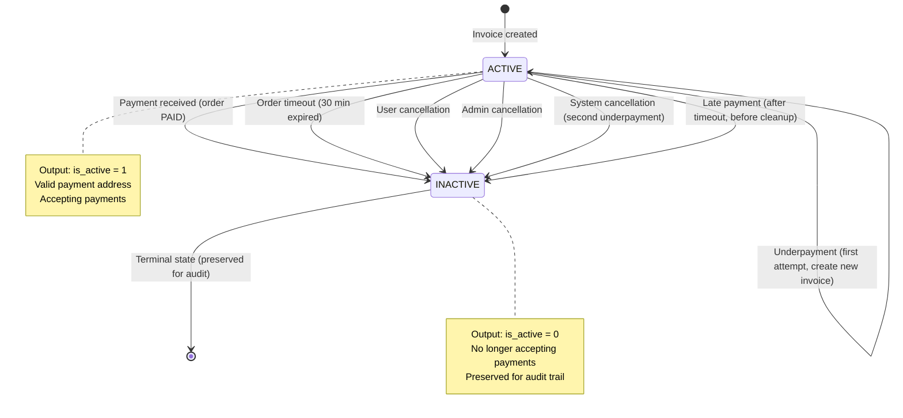

# Invoice Status State Machine (Moore Automaton)

## Overview

This document models the invoice lifecycle as a **Moore automaton**, where the output (invoice state) depends only on the current state, not on the input transitions. Each invoice has an `is_active` flag that represents its current operational status.

## Moore Automaton Definition

In a Moore machine:
- **States** have associated outputs (here: `is_active` flag value)
- **Transitions** are triggered by events (payment, timeout, cancellation)
- **Output** is determined solely by the current state

### States and Outputs

| State | is_active | Description |
|-------|-----------|-------------|
| ACTIVE | 1 | Invoice with valid payment address, awaiting payment |
| INACTIVE | 0 | Invoice expired, cancelled, or superseded |

## State Machine Diagram (Mermaid)



## Detailed State Descriptions

### ACTIVE State (is_active = 1)

**Output Value:** `1`

**Characteristics:**
- Invoice has valid payment address
- Actively accepting cryptocurrency payments
- Order is in `PENDING_PAYMENT*` status
- Within order timeout window (default 30 minutes)

**Entry Conditions:**
1. Invoice creation via KryptoExpress API
2. Wallet balance insufficient to cover full order amount
3. Payment address successfully generated

**Possible Transitions:**
- **ACTIVE → ACTIVE**: Underpayment (first attempt)
  - Creates new invoice for remaining amount
  - Original invoice stays ACTIVE temporarily
  - Both invoices track partial payments

- **ACTIVE → INACTIVE**: Payment received
  - Full payment confirmed by webhook
  - Order transitions to PAID
  - Invoice preserved as payment record

- **ACTIVE → INACTIVE**: Order timeout
  - Background job detects `expires_at` passed
  - No payment received within window
  - Invoice marked inactive, order cancelled

- **ACTIVE → INACTIVE**: User cancellation
  - User clicks "Cancel Order"
  - Voluntary termination before payment
  - Invoice invalidated

- **ACTIVE → INACTIVE**: Admin cancellation
  - Admin terminates order
  - With or without custom reason
  - Invoice invalidated

- **ACTIVE → INACTIVE**: System cancellation
  - Second underpayment (retry exhausted)
  - Payment fraud detected
  - Critical validation error

- **ACTIVE → INACTIVE**: Late payment
  - Payment arrives after `expires_at`
  - Before timeout job cleanup
  - Order still accepted (race condition)

**Code References:**
- Invoice creation: `services/invoice.py:create_invoice_with_kryptoexpress()`
- Active check: `repositories/invoice.py:get_by_order_id(include_inactive=False)`

---

### INACTIVE State (is_active = 0)

**Output Value:** `0`

**Characteristics:**
- Invoice no longer accepts payments
- Payment address invalidated (if applicable)
- Preserved for audit trail and compliance
- Order in terminal state (PAID, TIMEOUT, CANCELLED_*)

**Entry Conditions:**
All transitions from ACTIVE state lead here.

**No Exit Transitions:**
INACTIVE is a terminal state. Once an invoice is marked inactive, it remains so permanently for audit purposes.

**Preservation Reasons:**
1. **Compliance**: Payment history for tax/legal requirements
2. **Audit Trail**: Track all payment attempts and outcomes
3. **Debugging**: Investigate payment issues and disputes
4. **Analytics**: Measure payment success rates and failure reasons

**Code References:**
- Mark inactive: `repositories/invoice.py:mark_invoices_inactive_for_order()`
- Query all: `repositories/invoice.py:get_all_by_order_id(include_inactive=True)`

---

## State Transition Events

### 1. Invoice Creation

**Event:** User selects cryptocurrency payment method

**Preconditions:**
- Order exists with `PENDING_PAYMENT*` status
- Wallet balance < order total price
- No active invoice exists for order

**Actions:**
1. Request payment address from KryptoExpress
2. Generate unique invoice number (INV-YYYY-XXXXXX)
3. Create invoice with `is_active = 1`
4. Set `order.expires_at = now() + ORDER_TIMEOUT_MINUTES`

**Result State:** ACTIVE

**Code:** `services/invoice.py:create_invoice_with_kryptoexpress()`

---

### 2. Payment Received (Full Amount)

**Event:** KryptoExpress webhook with status PAID

**Preconditions:**
- Invoice `is_active = 1`
- Payment amount matches expected (within tolerance)

**Actions:**
1. Create PaymentTransaction record
2. Mark order as PAID
3. Deliver items (mark sold, create Buy records)
4. Keep invoice ACTIVE as payment record

**Result State:** INACTIVE (marked after order completion)

**Code:** `processing/payment_handlers.py:handle_paid_status()`

---

### 3. Underpayment (First Attempt)

**Event:** KryptoExpress webhook with UNDERPAYMENT status

**Preconditions:**
- Invoice `is_active = 1`
- Payment < expected (outside tolerance)
- `payment_attempt = 1` (first attempt)

**Actions:**
1. Create PaymentTransaction record
2. Create new invoice for remaining amount
3. Original invoice stays ACTIVE (tracks partial payment)
4. Extend order timeout (+30 minutes)

**Result State:** ACTIVE (original) + ACTIVE (new invoice)

**Note:** This is the only transition that creates a new ACTIVE invoice while keeping the original ACTIVE.

**Code:** `processing/payment_handlers.py:handle_underpayment()`

---

### 4. Order Timeout

**Event:** Background job runs after `order.expires_at`

**Preconditions:**
- Invoice `is_active = 1`
- Current time > `order.expires_at`
- No payment received

**Actions:**
1. Mark all invoices `is_active = 0`
2. Update order status to TIMEOUT
3. Release reserved items
4. Refund wallet (with penalty if late)
5. Add user strike (if outside grace period)

**Result State:** INACTIVE

**Code:** `jobs/order_timeout_job.py`

---

### 5. User Cancellation

**Event:** User clicks "Cancel Order" button

**Preconditions:**
- Invoice `is_active = 1`
- Order status `PENDING_PAYMENT*`

**Actions:**
1. Mark all invoices `is_active = 0`
2. Update order status to CANCELLED_BY_USER
3. Refund wallet (with penalty if late)
4. Release reserved items
5. Add strike if outside grace period

**Result State:** INACTIVE

**Code:** `services/order.py:cancel_order()`

---

### 6. Admin Cancellation

**Event:** Admin clicks "Cancel Order"

**Preconditions:**
- Invoice `is_active = 1`
- Order status `PENDING_PAYMENT*` or `PAID_AWAITING_SHIPMENT`

**Actions:**
1. Mark all invoices `is_active = 0`
2. Update order status to CANCELLED_BY_ADMIN
3. Full wallet refund (no penalty)
4. Release reserved items
5. No strike applied

**Result State:** INACTIVE

**Code:** `handlers/admin/shipping_management.py:cancel_order_admin_execute()`

---

### 7. System Cancellation

**Event:** Second underpayment OR fraud detection

**Preconditions:**
- Invoice `is_active = 1`
- Second underpayment (retry exhausted)
- OR payment fraud detected

**Actions:**
1. Mark all invoices `is_active = 0`
2. Update order status to CANCELLED_BY_SYSTEM
3. Credit received amount to wallet
4. Release reserved items
5. No strike (system issue)

**Result State:** INACTIVE

**Code:** `processing/payment_handlers.py:handle_underpayment()`

---

### 8. Late Payment

**Event:** Payment arrives after `expires_at` but before timeout job

**Preconditions:**
- Invoice `is_active = 1`
- Payment timestamp > `order.expires_at`
- Order not yet cleaned up by timeout job

**Actions:**
1. Accept payment (order fulfilled)
2. Mark order as PAID
3. Deliver items
4. Mark invoice `is_active = 0` (payment complete)
5. No penalty (purchase completed)

**Result State:** INACTIVE

**Important:** This is a race condition window. Payment is accepted because order completion eliminates opportunity cost.

**Code:** `processing/payment_handlers.py:handle_paid_status()`

---

## Invoice Query Patterns

### Active Invoices Only

**Use Case:** Payment processing, user-facing payment views

```python
invoice = await InvoiceRepository.get_by_order_id(
    order_id,
    session,
    include_inactive=False  # Default
)
```

Returns only invoices with `is_active = 1`.

---

### All Invoices (Audit Trail)

**Use Case:** Admin views, payment history, debugging, compliance

```python
invoices = await InvoiceRepository.get_all_by_order_id(
    order_id,
    session,
    include_inactive=True
)
```

Returns all invoices including inactive ones for complete audit trail.

---

## Moore Automaton Properties

### Output Function

```
Output(state) = is_active value
  Output(ACTIVE) = 1
  Output(INACTIVE) = 0
```

The output is determined **solely by the state**, not by the transition that led to it.

### Deterministic Transitions

For any given state and input event, there is exactly one next state:
- ACTIVE + payment_received → INACTIVE
- ACTIVE + timeout → INACTIVE
- ACTIVE + cancellation → INACTIVE

### Single Terminal State

INACTIVE is the only terminal state. All paths eventually lead to INACTIVE, and once reached, the invoice remains there permanently.

### State Invariants

**ACTIVE Invariants:**
- Must have valid `payment_address` (except wallet-only invoices)
- Order must be in `PENDING_PAYMENT*` status
- Must be within timeout window OR first underpayment retry

**INACTIVE Invariants:**
- Never transitions back to ACTIVE
- Always preserved (no deletion)
- Audit trail maintained indefinitely

---

## Database Schema

```sql
CREATE TABLE invoices (
    id INTEGER PRIMARY KEY,
    order_id INTEGER NOT NULL,
    invoice_number VARCHAR UNIQUE NOT NULL,
    payment_address VARCHAR,
    payment_amount_crypto FLOAT,
    payment_crypto_currency VARCHAR,
    payment_processing_id INTEGER,
    fiat_amount FLOAT NOT NULL,
    fiat_currency VARCHAR NOT NULL,
    is_partial_payment INTEGER DEFAULT 0,
    parent_invoice_id INTEGER,
    actual_paid_amount_crypto FLOAT,
    payment_attempt INTEGER DEFAULT 1,
    is_active INTEGER NOT NULL DEFAULT 1,  -- Moore automaton output
    FOREIGN KEY (order_id) REFERENCES orders(id),
    FOREIGN KEY (parent_invoice_id) REFERENCES invoices(id)
);

CREATE INDEX idx_invoices_is_active ON invoices(is_active);
CREATE INDEX idx_invoices_order_id ON invoices(order_id);
```

---

## Configuration

```python
# Timeout window for ACTIVE state
ORDER_TIMEOUT_MINUTES = 30

# Grace period for free cancellation
ORDER_CANCEL_GRACE_PERIOD_MINUTES = 5

# Underpayment retry configuration
PAYMENT_UNDERPAYMENT_TOLERANCE_PERCENT = 2.0

# Late payment penalty (not applied if order fulfilled)
PAYMENT_LATE_PENALTY_PERCENT = 5.0
```

---

## Related Documentation

- [Invoice Lifecycle](./INVOICE_LIFECYCLE.md) - Detailed lifecycle documentation
- [Order Status State Machine](../order/ORDER_STATUS_STATE_MACHINE.md) - Order state transitions
- [Payment Processing](./PAYMENT_PROCESSING.md) - Payment flow details

---

## Migration History

- `009_add_invoice_is_active.sql`: Added `is_active` column (Moore automaton output)
  - Default value: 1 (ACTIVE)
  - Index created for query performance
  - Existing invoices set to ACTIVE by default
